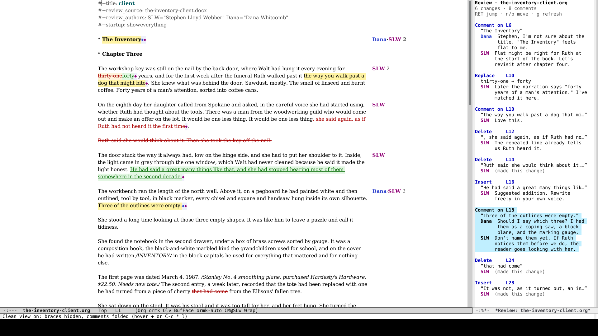
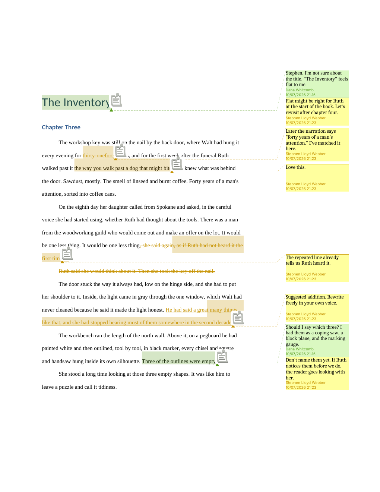

#+title: redline

Review a Word manuscript in Emacs the way you would in Word: tracked changes, comment threads, replies, accept and reject. When you're done, send back a .docx the author opens in Word or LibreOffice with your edits as real tracked changes, and with the author's own fonts and styles left as they were.

The same edits, opened in LibreOffice:

* What it does

- *Opens a .docx as org.* =M-x redline-import= writes =NAME.org= beside the Word file. The author's tracked changes and comments come in as [[https://criticmarkup.com][CriticMarkup]], the plain-text markup [[https://github.com/joostkremers/criticmarkup-emacs][cm-mode]] edits: ={++added++}=, ={--deleted--}=, ={~~old~>new~~}=, ={==text==}{>>@Author comment<<}=. Replies come in as threads, and resolved comments show a ✓.
- *Tracks your edits.* In a file made from a .docx, change tracking is on from the start: typing and deleting are recorded under your initials, the way Word's Track Changes would be.
- *Gives you a review pane.* =C-c * l= lists every change and comment thread with its author. From there you can accept, reject, resolve, or delete, one at a time or all at once. Moving point onto a change lights up its entry.
- *Shows who commented, in the margin.* Each commented paragraph gets an author tag in the right margin. Click it to open the thread.
- *Has a clean view.* =C-c * h= hides the braces and folds comments into small markers, closer to how Word shows a marked-up page. The file itself is unchanged.
- *Sends it back as Word.* =M-x redline-export= writes =NAME-TAG-DATE.docx= beside the org file:
  - paragraphs you didn't touch are copied from the original byte for byte;
  - a paragraph you edited takes its formatting from the original character by character, so fonts, sizes, and paragraph styles come back as they were;
  - switching italics or bold becomes a tracked formatting change the author can reject, and so does changing a heading's level;
  - splitting or joining paragraphs while tracking is recorded the way Word records it, so rejecting everything gives back the original paragraphs;
  - Track Changes is switched on in the file, so the author's answers are tracked too (=redline-word-tracking-on=).

  The original .docx is only ever read, and no file is written over.

* Requirements

- Emacs 29.1 or later
- [[https://github.com/joostkremers/criticmarkup-emacs][cm-mode]] (GNU ELPA and MELPA)
- Python 3 with [[https://lxml.de][lxml]]. On Debian and Ubuntu: =sudo apt install python3-lxml=. Elsewhere: =pip install lxml=. The .docx work happens in =redline.py=, which comes with the package.

* Installing

Until redline is on MELPA, Emacs 30 can install it straight from GitHub:

#+begin_src emacs-lisp
(use-package redline
  :vc (:url "https://github.com/offgridauthor/redline" :rev :newest)
  :hook (org-mode . redline-maybe-enable)
  :bind ("C-c * o" . redline-import)
  :custom
  (redline-my-name "Your Name")                    ; as Word should show it
  (redline-my-other-names '("Your N")))            ; older names Word has for you; see below
#+end_src

With a local clone, use =:load-path "~/path/to/redline"= in place of =:vc=.

Word labels each change with whatever name that copy of Word had for you, so earlier rounds of the same job can carry several versions of your name. List them in =redline-my-other-names= and changes under them come in as yours, with your tag, to revise as your own work. Each still goes back to Word under the name it was made with.

=redline-maybe-enable= turns on =redline-mode= only in org files that came from a .docx or already contain CriticMarkup, so the rest of your org files stay as they are. Your initials come from =cm-author= (set it with =(setq-default cm-author "XYZ")= or =C-c * t=).

* Keys

cm-mode's own keys work as usual under =C-c *=: =F= turns tracking on and off, =i= accepts or rejects the change at point, =t= changes who you are. redline adds or improves:

| Key       | Does                                                         |
|-----------+--------------------------------------------------------------|
| =C-c * l= | Review pane                                                  |
| =C-c * h= | Clean view on or off                                         |
| =C-c * r= | Reply to the comment thread at point                         |
| =C-c * c= | Comment on the region, or at point (on a comment: reply)     |
| =C-c * k= | Delete just the one comment at point                         |
| =C-c * o= | Open a .docx                                                 |
| =C-c * w= | Export to .docx                                              |

In the review pane: =RET= jumps to the text, =a= / =r= accept or reject, =c= marks a thread resolved, =k= deletes a thread, =A= / =R= accept or reject everything, =g= refreshes.

* Comments over a long passage

CriticMarkup can't nest one piece of markup inside another, so a comment on a passage that crosses paragraphs or other changes can't be a single ={==...==}=. =C-c * c= highlights the passage in pieces instead, with the comment after the last:

#+begin_example
{==two.==}

* {==Heading==}

{==Three==} {++x++}{>>@SLW<<} {==four==}{>>@SLW the note<<}
#+end_example

The review pane lists it as one comment, deleting it takes every piece's braces with it, and export sends Word one comment over the whole passage. A selection that starts or ends inside other markup is trimmed to the text outside it.

* What comes across, and what doesn't

Kept and editable: text, tracked insertions and deletions (including ones from several authors), paragraph splits and joins, comments and reply threads, resolved comments, italics, bold, line breaks, headings, and changes saved with no author name.

Kept, though not editable as text:

- *Links, citations, footnote and endnote marks, images, and other fields.* Each shows inside its paragraph as a link like =[[docx:12.0][see the report]]=. You can move it or delete it (tracked), and the paragraph around it stays editable.
- *Tables, and fields that stretch across paragraphs.* These come in as a =#+docx_block:= line and go back out unchanged.
- *Everything else:* bookmarks, the author's own tracked formatting changes, empty paragraphs, headers, footers, footnote text, page setup, and styles.

Not yet:

- *Comments spanning paragraphs, coming from Word.* These come in pinned to the end of the passage. (Ones you make in Emacs go out to Word over their whole passage; see below.)
- *Tracked moves.* These come back as a deletion plus an insertion.
- *Text inside tables* isn't editable.
- *Unusual emphasis.* If org can't express a paragraph's italics or bold (an italic bracket, say), that paragraph shows them plainly in org and keeps them as they were in Word.

* How it's been tested

- *Word files from the wild:* the bridge has been run over about 190 real .docx files. That's 88 from pandoc's test suite, plus about a hundred working manuscripts, edits, and style sheets saved by Word 2007 through Microsoft 365 (Windows and Mac), LibreOffice, and other tools, with over 30,000 tracked changes and 3,000 comments between them.
- *What each file went through:* importing and exporting with no edits gives every body element back unchanged. Edits of every kind read back the same. Every export opens in LibreOffice and passes an OOXML schema check, and rejecting all of the editor's changes gives back the original text.
- *The test suite:* =make check= byte-compiles, lints, and runs the Emacs and Python tests. =python3 test/corpus.py redline.py FOLDER= puts any folder of .docx files through the same paces.

* Related

- [[https://github.com/joostkremers/criticmarkup-emacs][cm-mode]] does the CriticMarkup editing underneath. Fixes found while making redline go to it first.
- tchanges.el (James Thomas, [[https://list.orgmode.org/86a5ikals7.fsf@gmx.net/T][org mailing list]]) also exchanges tracked changes with Word users, keeping comments in bookmarks.
- [[https://pandoc.org][pandoc]] reads and writes Word tracked changes, but it makes a new document rather than patching the author's.

* License

GPL-3.0-or-later. See [[file:LICENSE][LICENSE]].
